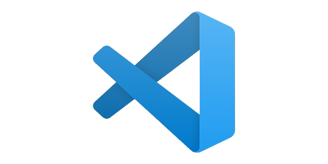

# Guia de instalación de Python en visual studio code

**Paso 1.** Usaremos cualquier IDE de programación si no tienes uno puedes usar visual studio code.

- [Descargar visual studio code](https://code.visualstudio.com/)

**Paso 2.** Procederemos a instalar el siguiente conjunto de extensiones para poder usar python.

- [Extension pack de Python](https://marketplace.visualstudio.com/items?itemName=donjayamanne.python-extension-pack)

**Paso 3.** Tras haber instalado todo lo necesario procederemos a crear una carpeta donde crearemos nuestros archivos con extensión **.py**