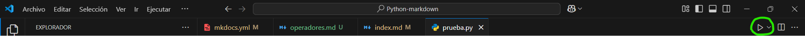
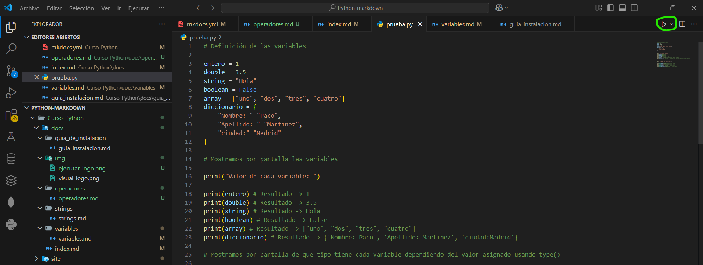

# En python las variables no tienen tipo, ya que a la hora de definir una variable el mismo ya sabe que valor va a tomar esa variable

## Tipos de variables

> Las variables toman los valores de forma automática que quiere decir esto que Python es un leguaje tipado dinámico. Esto significa que el tipo de una variable se determina en tiempo de ejecución, no en tiempo de compilación. Por tanto, no es necesario declarar el tipo de una variable cuando se crea. 

* Definición de una variable con un valor de tipo entero.
``` python
entero = 1
```

* Definición de una variable con un valor de tipo doble, es decir, decimal.
``` python
double = 3.5
```
* Definición de una variable de tipo string, es decir, una varible que solo almacena texto.
``` python
string = "Hola"
```
* Definición de una variable booleana, es decir, una variable que solo almacena True o False y como valor por defecto se le
asigna False.
``` python
boolean = False
```
* Definición de una variable de tipo array, es decir, una colección ordenada de elementos. Los elementos pueden ser de cualquier tipo (números, cadenas, otros arrays, etc.), y se acceden mediante un índice numérico que empieza en 0. 
``` python
array = ["uno", "dos", "tres", "cuatro"]
```
* Definición de una variable de tipo diccionario, es decir, una colección no ordenada de pares clave-valor. En lugar de usar índices numéricos como en las listas, usamos claves para acceder a los valores.
``` python
diccionario = {
        'Nombre': 'Paco', 
        'Apellido': 'Martinez', 
        'Ciudad': 'Madrid'
}

```

## Mostrar valores por consola con print()

> **print()** es una función incorporada en Python que se usa para mostrar información en la salida estándar (normalmente la consola). Puede imprimir uno o más valores, separadolos con un espacio por defecto. Voy a poner ejemplos de como se usa el **print()** con las variables anteriores.

``` python
print(entero) # Resultado -> 1
```

``` python
print(double) # Resultado -> 3.5
```

``` python
print(string) # Resultado -> Hola
```

``` python
print(boolean) # Resultado -> False
```

``` python
print(array) # Resultado -> ["uno", "dos", "tres", "cuatro"]
```

``` python
print(diccionario) # Resultado -> {'Nombre': 'Paco', 'Apellido': 'Martinez', 'Ciudad': 'Madrid'}
```
## Mostrar por pantalla el tipo que tiene la variable

> También podemos usar **print()** para mostrar por pantalla que tipo tiene cada variable dependiendo del valor asignado usando **type()**.

``` python
print(type(entero)) # Resultado -> <class 'int'>

print(type(double)) # Resultado -> <class 'float'>

print(type(string)) # Resultado -> <class 'str'>

print(type(boolean)) # Resultado -> <class 'bool'>

print(type(array)) # Resultado -> <class 'list'>

print(type(diccionario)) # Resultado -> <class 'set'>
```

> También podemos declarar multiples variables en una línea, no es recomendable pero se puede hacer.

``` python
nombre, edad, es_mayor, pie = "Luis", 25, True, 42.5
```
## Acceder a un diccionario

> Para acceder a un diccionario se acceder de forma parecida a una array, pero en este caso en vez de poner la posición le ponemos el valor al que queremos acceder.

**Paso 1.** Definimos el diccionario

``` python
    Informacion = {
        'Nombre': 'Pedro', 
        'Apellido': 'Gonzalez', 
        'Pais': 'España',
        'Ciudad': 'Getafe',
        'Edad': 24
    }
```

**Paso 2.** Accedemos a `Nombre` y `Edad`:

``` python
    print(Informacion['Nombre'], Informacion['Edad']) # Resultado -> Pedro 24
```
## Ejemplo de código para probar su funcionamiento implementando todo lo anterior mencionado

**Paso 1.** Creamos nuestro archivo llamado `ejemplo1.py`.

**Paso 2.** Pegaremos el siguiente código y le daremos al boton de ejecutar, si no sabes cual boton es el de ejecutar
buscaremos un boton en la parte superior como se muestra en la foto resaltado en verde.





``` python

# Definición de las variables

entero = 1
double = 3.5
string = "Hola"
boolean = False
array = ["uno", "dos", "tres", "cuatro"]
diccionario = {
    "Nombre: " "Paco",
    "Apellido: " "Martinez",
    "ciudad:" "Madrid"
}

# Mostramos por pantalla las variables

print("Valor de cada variable: ")

print(entero) # Resultado -> 1
print(double) # Resultado -> 3.5
print(string) # Resultado -> Hola
print(boolean) # Resultado -> False
print(array) # Resultado -> ["uno", "dos", "tres", "cuatro"]
print(diccionario) # Resultado -> {'Nombre: Paco', 'Apellido: Martinez', 'ciudad:Madrid'}

# Mostramos por pantalla de que tipo tiene cada variable dependiendo del valor asignado usando type()

print("\nTipo que toma cada variable: ")

print(type(entero)) # Resultado -> <class 'int'>
print(type(double)) # Resultado -> <class 'float'>
print(type(string)) # Resultado -> <class 'str'>
print(type(boolean)) # Resultado -> <class 'bool'>
print(type(array)) # Resultado -> <class 'list'>
print(type(diccionario)) # Resultado -> <class 'set'>

``` 